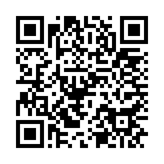
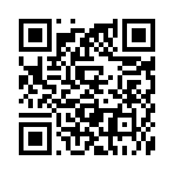

<!-- Written by tools/donation-page.py. Do not edit by hand: change an address with
     `python tools/donation-page.py --set`, which verifies it and draws its QR code again. -->

<h1 align="center">&#9829; Support P2Poker</h1>

<p align="center">
<b>No house. No server. No rake. No ads.</b><br>
P2Poker is free, open source and peer to peer &mdash; nobody earns a cent when you play.<br>
If it gave you a good evening at the tables, this is how it keeps going.
</p>

<p align="center"><sub>A donation is a gift. It buys no chips, no rank and no advantage at any table:
the game is play money, and it stays fair for everybody.</sub></p>

---

<h2 align="center"> Bitcoin</h2>

<p align="center"><sub>native SegWit, P2WPKH &middot; Bitcoin main network</sub></p>

<p align="center"></p>

<!-- donation:bitcoin -->
```
bc1qgecm54r5rqhaqxu6p9472fqq9fmejkph9c3hud
```
<!-- /donation:bitcoin -->

<p align="center"><sub>Send <b>Bitcoin only</b> to this address.</sub></p>

---

<h2 align="center"> Tether &middot; USDT</h2>

<p align="center"><sub>TRC-20 &middot; <b>TRON network</b></sub></p>

<p align="center"></p>

<!-- donation:tether-tron -->
```
TTn7xZ6UqLRiiYjvvnnpcT3gPJCz23nzJv
```
<!-- /donation:tether-tron -->

<p align="center"><sub>Send USDT over the <b>TRON network (TRC-20)</b> only. The same coin sent over
Ethereum, BNB Chain or any other network does not arrive.</sub></p>

---

### Before you send

* **Compare the first six and the last six characters** of the address in your wallet with the ones on this
  page, after you scan or paste. Malware that swaps an address in the clipboard for a thief's own is real, and
  the address it puts there is a perfectly valid one.
* **This page is the only place these addresses are published.** The client's *Support the project* button
  opens exactly this file, and the repository's history shows every change ever made to it.
* Both QR codes say nothing but the address above them (`bitcoin:` and the address, for Bitcoin).

<p align="center"><b>Thank you.</b> &#9824;&#65039; &#9829;&#65039; &#9830;&#65039; &#9827;&#65039;</p>

<sub>The addresses and their QR codes are written by <code>tools/donation-page.py</code>, which takes an address
only if its checksum holds and publishes a QR code only after an independent decoder has read the address back
out of it. <code>python tools/donation-page.py --check</code> repeats both for what is here now.</sub>
