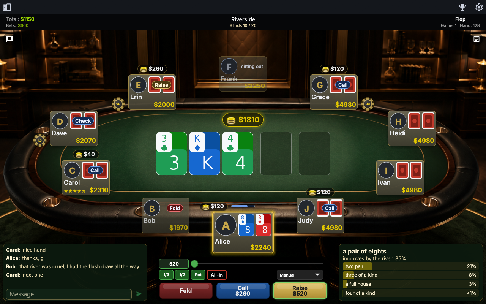

# p2p-poker

Decentralised, serverless No-Limit Texas Hold'em. No house, no dealer, no
trusted third party — the players *are* the dealer, and the deal is proved
rather than promised.

Written in Rust. One portable executable.



*The table window with all ten seats taken, drawn from the client's built-in
sample hand (`--table-preview --preview-seats 10 --preview-odds --preview-chat
--preview-showcase`). The look follows PokerTH's Green Casino table; see
[`assets/pokerth/PROVENANCE.md`](assets/pokerth/PROVENANCE.md).*

> **Status: in progress.** The poker engine, the protocol layer and the mental
> poker construction are complete and tested. Two clients discover each other,
> exchange signed table advertisements, and **form a table** — a roster every
> seat has ratified, ending in a session identity all of them compute
> identically. What is not yet wired is the hand itself: the engine deals one
> between three peers in memory, and nothing yet carries the deck messages
> between two processes. See [`NEXT.md`](NEXT.md).

---

## Why this exists

Online poker asks you to trust a server with the deck. That server knows every
hole card, and you are asked to believe it does not act on them. This project
removes the server instead of trusting it.

A hand is dealt by **mental poker**: every player shuffles the deck under
encryption, proves in zero knowledge that they shuffled it honestly and did not
substitute a card, and no card can be opened without a share from *every* seat.
A player who leaves cannot be dealt around; a player who cheats cannot do so
undetectably. There is no point in the protocol at which any participant, or any
observer, can see a card they are not entitled to.

## How it works

| Layer | What it does |
|---|---|
| **Mental poker** | Barnett–Smart with Bayer–Groth shuffle proofs over secp256k1. `n`-of-`n` threshold ElGamal: every seat holds a share, and a card opens only when all of them are given. |
| **Transcript** | Every event is canonical CBOR, signed Ed25519, and hash-chained. Two players who disagree about what happened can prove which of them is wrong. |
| **Discovery** | The public libp2p Kademlia DHT: every client announces itself a provider of one agreed key and asks who else is. Relays are found the same way, under `/libp2p/relay`, which is where go-libp2p's own AutoRelay looks. mDNS for players on your own network. |
| **NAT** | Three ways to open a port: UPnP IGD, and PCP and NAT-PMP for the routers that speak those instead. AutoNAT v2 then decides whether this client is *actually* reachable — a router's confirmation is not the same claim. Circuit Relay v2 carries a hand when nothing opens, and DCUtR upgrades a relayed connection to a direct one. Relay capacity is judged against **measured** per-hand bytes rather than against a guess. |
| **Poker** | A complete No-Limit Hold'em engine: blinds, dead button, side pots, TDA reopening rules. Around 120 000 random hands run in the test suite. |

Nothing is a service. Every one of those runs inside the same executable on
every player's machine.

## Running it

```bash
cargo build --release
```

```bash
./target/release/p2p-poker
```

The window opens on the lobby. **Create table** advertises one; **Join table**
sits down at somebody else's. The table itself opens in a window of its own,
beside the lobby, and the other players appear in it as they sit down.

**Find a game** does the looking for you: choose a format (heads-up, six seats,
the full ring of ten, or whatever fills first) and how many games you want at once, and
the client reserves seats at the tables closest to starting, founds one of its
own when nothing is on offer, lets that one start with the players who came,
and gives every other seat back the moment a game starts. The window shows the
clock, the estimate, how many others are searching and where seats are held,
and one button, which cancels at once.

A new table is a **rated Sit-and-Go** by default: ten seats, 10 000 chips each,
blinds 50/100 doubling every eleven hands, and it deals when all ten are in.
Those numbers are not a choice — they are `RATED_SNG_POKERTH_V1`, read out of
PokerTH's own `RANKING_GAME_*` constants, and every client derives the same
parameters from the name alone. That is what lets two people who have never
spoken agree on the game before either sits down. A custom cash table is one
click away for everything else.

Two clients on one machine are two players only if they keep two profiles — the
protocol refuses a second seat to the same node at the same table, deliberately:

```bash
./target/release/p2p-poker --headless --profile ./A --host Riverside --for 45
```

```bash
./target/release/p2p-poker --headless --profile ./B --join Riverside --for 40
```

Both print `TABLE FORMED session=…` with the same session identity.

| Flag | |
|---|---|
| `--headless` | the node without a window; a scripted run, or a volunteer relay |
| `--profile DIR` | keep the profile somewhere other than beside the binary |
| `--host NAME` | advertise a table called `NAME` — a rated Sit-and-Go |
| `--seats N` | make it a custom table of `N` seats instead (a rated one needs all ten) |
| `--min N` | how many of them it starts with |
| `--join NAME` | sit down at the first table called `NAME` |
| `--search hu` \| `6` \| `10` \| `auto` | find a game automatically, from the start |
| `--search-tables N` | how many games at once the search aims at, 1 to 4 |
| `--search-again` | search again when the game the search found ends |
| `--table` | open on the table rather than the lobby |
| `--for N` | stop after `N` seconds |
| `--renderer gl` \| `software` | pin the renderer instead of letting it choose |
| `--no-mdns` | do not look for players by multicast — how the DHT path gets tested |

### On a machine with no graphics driver

The window draws with OpenGL, and a virtual machine without graphics
acceleration has only the OpenGL 1.1 that Windows ships, where the window needs
2.0. The client does not stop there. It starts itself again on Direct3D 12,
which with no driver present resolves to **WARP** — `Microsoft Basic Render
Driver`, a software rasteriser that is part of Windows rather than of any
driver — and prints which adapter it ended up on:

```text
the window could not open: egui_glow: OpenGL: egui_glow requires opengl 2.0+.

No OpenGL 2.0 on this machine. Starting again in software.
drawing  Microsoft Basic Render Driver (Cpu)
window   open (software)
```

Nothing to install, and nothing to type: `--renderer` exists to override the
choice, not to make it. It is a second process because a process gets one event
loop and no more, so a renderer cannot be retried in place.

`window   open (…)` is printed from inside a window that exists, so it is the
line a script waits for. A run that never got that far says why and **exits
non-zero** — 1 when the window could not open, 2 for an argument it does not
understand. Every failure used to exit 0, including a profile that could not be
created, which meant a client that never started was indistinguishable from one
that ran and found nothing.

## It is portable, and that is checked

One executable, around 26 MB, statically linked against the C runtime. Five of
those megabytes are the second renderer, which is what makes it start on a
machine with no graphics driver at all. Copy it
into an empty folder and it runs, creating exactly `profile/identity.key` and
`profile/player.key` beside itself — two keys, because the protocol keeps the
network identity and the player identity apart. Two folders are two players.

`tools/check-portable.ps1` verifies all of that by measurement, including that
the binary imports no C runtime and that the two identities really are two
different secrets.

## Testing

```bash
cargo test --release -- --test-threads=19
```

Around 600 tests. Some of what they cover:

- **the engine**, against a reference over ~120 000 random hands;
- **the deck**, end to end — shuffle, prove, verify, open, with the proof sizes
  and timings measured rather than assumed;
- **two nodes in one process**, with a real QUIC handshake and a real GossipSub
  mesh, and a signed advertisement crossing it;
- **a relay circuit** that actually carries traffic;
- **a whole table formed over a real connection**, from the first join request
  to a session identity both sides compute identically;
- **the table geometry** — that the player is always at the bottom, that chips
  are never covered by a card, and that nothing is drawn outside the window — at
  every seat count from two to ten and five window sizes.

Two habits this project holds itself to, because both have paid:

**Every guard is verified to bite.** Disable the check, run the test that claims
to cover it, require a failure, restore it. A test that passes whether or not
the thing it guards exists is worse than no test.

**A measurement beats a recollection.** The relay defaults, the proof sizes, the
import table — measured, and several of them disagreed with the text written
around them.

## Tools

| | |
|---|---|
| `tools/deploy.ps1` | test, build, copy to where it is played from — never touching the profile |
| `tools/clean.ps1 -Deep` | sweep the build directory of what cargo never deletes. It reached 5 GB; 2.7 of that was dead |
| `tools/check-portable.ps1` | prove the binary is still one portable file with two separate identities |
| `tools/two-network-test.ps1` | one node here, one in a VM on another subnet |

## Documentation

The design is written down before it is built, and the documents are normative:

- [`docs/PROTOCOL.md`](docs/PROTOCOL.md) — the wire protocol, message by message
- [`docs/STATE_MACHINE.md`](docs/STATE_MACHINE.md) — the hand, as a state machine
- [`docs/CRYPTOGRAPHY.md`](docs/CRYPTOGRAPHY.md) — the constructions and why they are sound
- [`docs/THREAT_MODEL.md`](docs/THREAT_MODEL.md) — what a fully modified client can and cannot do
- [`docs/DECISIONS.md`](docs/DECISIONS.md) — every decision, including the ones that were withdrawn
- [`NEXT.md`](NEXT.md) — where the work is now

## What this is not

**It is not a gambling product.** It plays for play money. There is no cashier,
no custody of funds, and no mechanism for settling a real-money debt — putting
one in would be a different project with a different set of legal obligations.

**It is not anonymous.** A client that multi-tables under one application key
links those tables to anyone watching the lobby. Using a distinct key per table
unlinks them and costs nothing.

**It does not solve Sybil.** One key per seat and one node per seat are
enforceable and enforced; one *person* per seat is not, and is not claimed.

## Licence

**GPL-3.0-or-later.** The full text is in [`LICENSE`](LICENSE).

It is not a preference. A table's game traffic rides a Tox group (D-019),
`c-toxcore` declares `GPL-3.0-or-later` in every source file, and linking it
makes this whole client that. `DECISIONS.md`'s D-019 records the trade under
"The price" and calls it a one-way door: MIT, Apache-2.0 and the dual form are
foreclosed, and the open item *"the project licence has never been chosen"* is
closed by a transport decision rather than by a licensing one.

The table window's look, its sounds, icons and font come from PokerTH, which is
AGPL-3.0-or-later; GPLv3 section 13 permits the combination, and AGPLv3 section
13's requirement about users interacting over a network applies to it as such.
[`assets/pokerth/PROVENANCE.md`](assets/pokerth/PROVENANCE.md) names every file,
its source and its terms.

The released binary always carries Tox, so the licence is unconditional.
`--no-default-features` builds without it and is a development convenience — a
contributor with no C toolchain, or a test run with no business opening a socket
— never a release.

    This program is free software: you can redistribute it and/or modify it
    under the terms of the GNU General Public License as published by the Free
    Software Foundation, either version 3 of the License, or (at your option)
    any later version.

    This program is distributed in the hope that it will be useful, but WITHOUT
    ANY WARRANTY; without even the implied warranty of MERCHANTABILITY or
    FITNESS FOR A PARTICULAR PURPOSE. See the GNU General Public License for
    more details.

    You should have received a copy of the GNU General Public License along
    with this program. If not, see <https://www.gnu.org/licenses/>.

### Building it

The default build needs the vendored C fetched once, at pinned commits:

    pwsh tools/build-tox.ps1
    cargo build --release
